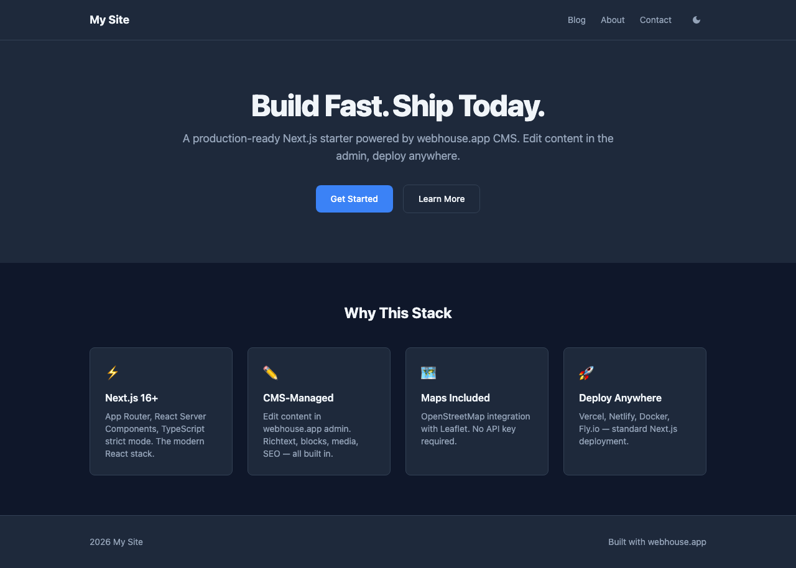

# Next.js GitHub Boilerplate



Everything from the Next.js Boilerplate plus GitHub storage adapter with live content updates via signed webhooks. Content lives in a GitHub repo, each edit is a commit.

**Documentation:** [docs.webhouse.app/docs/templates](https://docs.webhouse.app/docs/templates)

## Quick Start

```bash
# Clone this example
git clone https://github.com/webhousecode/cms.git
cd cms/examples/nextjs-github-boilerplate
npm install

# Start development
npm run dev

# Build for production
npm run build
```

## Collections

3 collections: `global`, `pages`, `posts` (same as Next.js Boilerplate)

## Features

- Everything from Next.js Boilerplate
- GitHub storage adapter (each edit = a Git commit)
- LiveRefresh SSE webhooks for instant browser updates
- HMAC-signed revalidation endpoint (`/api/revalidate`)
- Content stream SSE endpoint (`/api/content-stream`)
- PR-based content review workflow

## Project Structure

```
nextjs-github-boilerplate/
  cms.config.ts       → Collection + field definitions
  content/            → JSON content files
  src/               → Next.js app source
  .next/             → Build output
  public/             → Static assets + uploads
```

## Managing Content

### Option 1: CMS Admin UI

```bash
npx @webhouse/cms-admin-cli
# Opens visual editor at http://localhost:3010
```

### Option 2: Edit JSON directly

Content is stored as JSON files in `content/`. Each file is one document:

```json
{
  "slug": "my-page",
  "status": "published",
  "data": {
    "title": "My Page",
    "content": "Markdown content here..."
  },
  "id": "unique-id",
  "_fieldMeta": {}
}
```

### Option 3: AI via Chat

Open CMS admin → click **Chat** → describe what you want in natural language.

## Deployment

```bash
# Vercel
npx vercel

# GitHub Pages
# Push dist/ to gh-pages branch

# Fly.io
fly deploy
```

See [Deployment docs](https://docs.webhouse.app/docs/deployment) for detailed guides.

## Learn More

- [Templates & Boilerplates](https://docs.webhouse.app/docs/templates) — all available templates
- [Configuration Reference](https://docs.webhouse.app/docs/config-reference) — cms.config.ts options
- [Field Types](https://docs.webhouse.app/docs/field-types) — all 22 field types
- [webhouse.app](https://webhouse.app) — the AI-native CMS

---

Built with [@webhouse/cms](https://github.com/webhousecode/cms)
